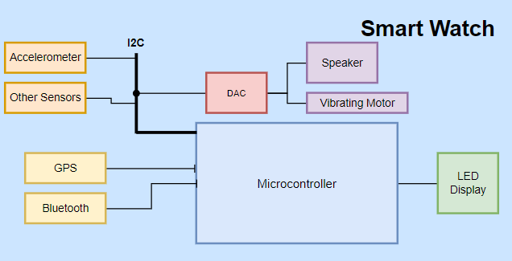

## Case study - 1
---------------------------------------------------
### Smart Watch

* __Accelerometer__
    * To determine how wearer's hand movements changes over time i.e. swipe, shake or tilting gestures. 
* __GPS__
    * To enable location tracking.
* __Bluetooth__
    * To transmit raw data (Enables calling and various smartphones integrated activities).
* __DAC__
    * Digital to Analog Converters to modify input digital signal into output analog signal.
* __Vibrating Motor__
    * For silent notifications.
* __Speaker__
    * For audio output.
* __LED Display__
    * Display time, date and other features related to display.
* __I2C__
    * This connection is chosen for sensor to chip communication for its minimal hardware requirement.

## Case study - 2
---------------------------------------------------
### Smart Bicycle System

* __GPS__
    * To enable location tracking.
* __Bluetooth__
    * To enable wireless link between user's smartphone and the smart bicycle.
* __RFID__
    * To enable docking and undocking of bicycle. The cycle will be unlocked if user is in close proximity and will be locked if not.
* __ROM__
    * To store data memory and program memory.
* __Wireless Protocol__
    * To enable communication with central server which will store informations like distance travelled, location, time of locking and unlocking the bicycle etc.
* __Fingerprint reader__
    * Enables docking and undocking of bicycle from parking station. It is optional since this obejctive can be achieved from RFID as well. But, for larger scale fingerprint reader is suggested given that many user might not be carrying their RFID tags (say adhaar card or driving licence) all the time.
* __UART__
    * To transmit and receive serial data.