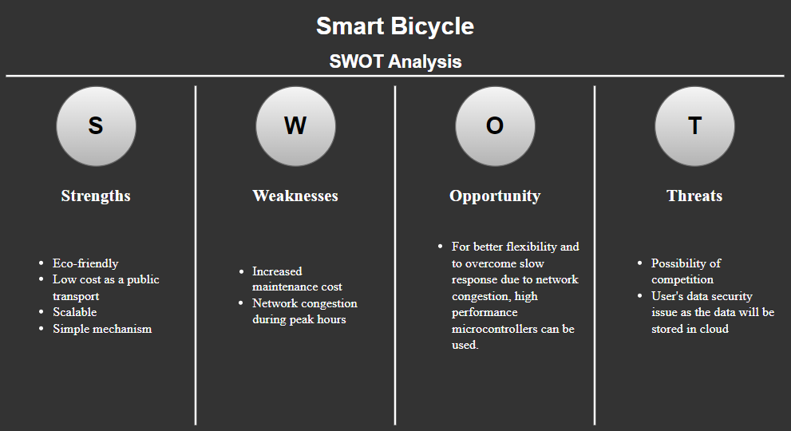

# **Requirements**
## **Introduction**
This project aims to add on features like distance sensors and centralised locking system to make bicycles smarter and setup a reliable renting system. This re-designed bicycle infrasturcture is aimed towards making it user-friendly and cost-effective. The work in this project is driven towards deployment of sensors on bicycles and parking stations.

## **Features**
- Installed with ultrasonic sensor to measure distance and alert the rider of any object/vehicle in close proximity of the bicycle.
- Parking stations installed with solenoid locks. 
- Locking and unlocking system with RFID (RFID can be used in smaller areas such as university campus where all staff and student possesses their ID cards but for larger areas such as public transport fingerprint reader would be more efficient and user-friendly).
- Location tracking using GPS.
- Connection with central server to collect informations like distance travelled, location, time of locking and unlocking the bicycle etc.

## **SWOT Analysis**

## **5W's and 1H**
- ### **Who:**
  Being a public mode of transport it can be used by everyone.
- ### **What:**
  This project provides a user-friendly bicycle renting system.
- ### **When:**
  Provides quick access to public transportation for desired destination  
- ### **Where:**
  Can be used daily commute within the premises of any campus or from one place to another.
- ### **Why:**
  To introduce sustainable transportation which is pollution free.
- ### **How:**
  The user scans their RFID tags (or punch fingerprint) to unlock bicycle and lock it to the parking station nearest to their destination.

## **High Level Requirements**
|  ID  | Description                                                                           |
| :--: | :------------------------------------------------------------------------------------ |
| HR01 | Should be aware of natural surroundings and obejcts near by                           |              
| HR02 | Should be able to generate travel history                                             |
| HR03 | Should be able to lock/unlock bicycle using RFID (or fingerprint reader)              |
| HR04 | Should be able to collect, read and store data of the bicycle and the rider           |
| HR05 | Should be durable to withstand less than than ideal conditions                        |

## **Low Level Requirements**
|  ID  | Description                                                                        |    HRID    |
| :--: | :--------------------------------------------------------------------------------- | :--------: |
| LR01 | Should have a ultrasonic distance sensor                                           |    HR01    |
| LR02 | Should have a display screen for informations' display to rider                    | HR01, HR03 |
| LR03 | Should be able GPS enabled                                                         |    HR02    |
| LR04 | Docking station should be installed with RFID scanner and user must have RFID tags |    HR03    |
| LR05 | Should be accurate when reading fingerprint                                        |    HR03    |
| LR06 | Should be able to communicate with the server and store essential data             |    HR04    |
| LR07 | Should undergo a regular maintainance                                              |    HR05    |