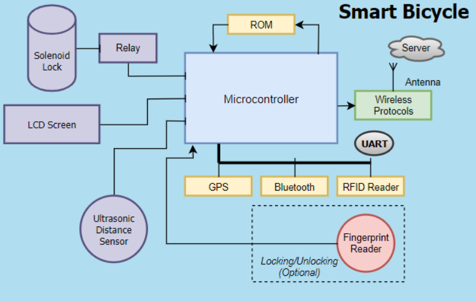
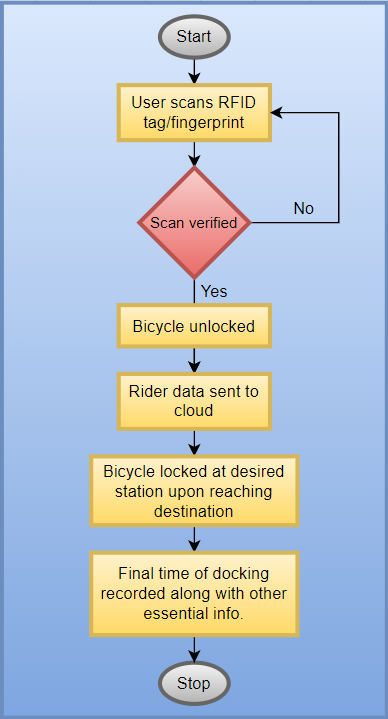
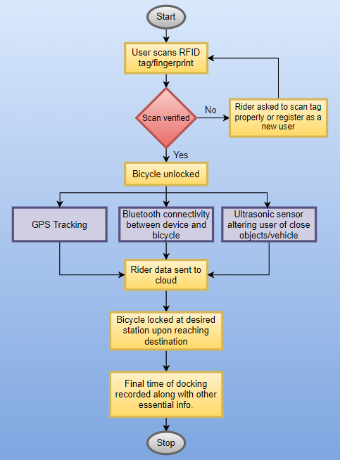

# **Architecture**
## **Smart Bicycle System Block Diagram**

| Component                  | Description                                                                                                                                                                                                                                                                                              |
| :------------------------- | :------------------------------------------------------------------------------------------------------------------------------------------------------------------------------------------------------------------------------------------------------------------------------------------------------- |
| Relay                      | To interface with solenoid lock for locking and unlocking                                                                                                                                                                                                                                                |
| LCD Display                | Displays information like distance of any object/vehicle from bicycle                                                                                                                                                                                                                                    |
| Solenoid Lock              | To lock the bicycle in parking station                                                                                                                                                                                                                                                                   |
| Ultrasonic Distance Sensor | To sense and alert user of any object/vehicle in close proximity                                                                                                                                                                                                                                         |
| GPS                        | To enable location tracking                                                                                                                                                                                                                                                                              |
| Bluetooth                  | To enable wireless link between user's smartphone and the smart bicycle                                                                                                                                                                                                                                  |
| RFID                       | To enable docking and undocking of bicycle. The cycle will be unlocked if user is in close proximity and will be locked if not                                                                                                                                                                           |
| ROM                        | To store data memory and program memory                                                                                                                                                                                                                                                                  |
| Wireless Protocol          | To enable communication with central server which will store informations like distance travelled, location, time of locking and unlocking the bicycle etc                                                                                                                                               |
| Fingerprint reader         | Enables docking and undocking of bicycle from parking station. It is optional since this obejctive can be achieved from RFID as well. But, for larger scale fingerprint reader is suggested given that many user might not be carrying their RFID tags (say adhaar card or driving licence) all the time |
| UART                       | To transmit and receive serial data                                                                                                                                                                                                                                                                      |

## **Behavorial Diagram**
- ### High Level Flow Chart Diagram

- ### Low Level Flow Chart Diagram
